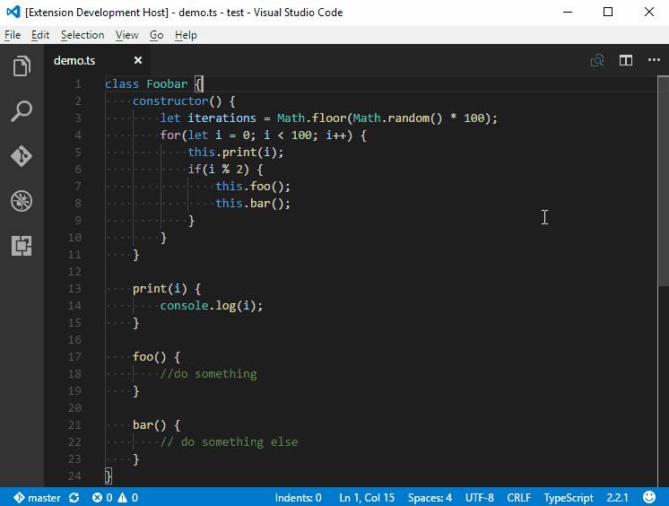
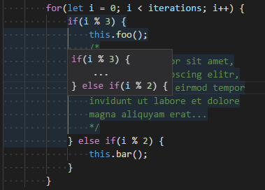
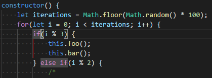

[](https://travis-ci.org/SirTori/indenticator)

# Indenticator

Visually highlights the current indent depth.

Can be used by itself, but it's recommended to use it alongside the builtin indent guides.

|  |
|- |
| *Example using default settings* |


## Feature Highlights

- **Peeking around the current indent block**: *Optionally* a hover can be added on the current indent marker to peek before and/or after the current indent block.<br/>
*To activate set **indenticator.showHover** to `true` to activate*

  |  |
  |- |
  | *Example has **indenticator.inner.color.dark** set to `#ff0000`*  |

- **Highlighting the the indent guide for the contained block**: *Optionally* a second indent highlight can be configured to highlight the block contained by the current cursor position<br/>
*To activate s **indenticator.inner.showHighlight** to `true` to activate*

  |  |
  |- |
  | Example has **indenticator.hover.peekBack** & **indenticator.hover.peekForward** set to `1`|

- **Language specific settings**: The extension can be configured for each language separately to accommondate the requirements of different coding styles.

  Example:
    ``` JS
    {
      "indenticator.languageSpecific": {
        "[json, jsonc]": {
          //...
        },
        "[xml, html, xhtml]": {
          //...
        }
      }
    }
    ```

- **Highlight Styling**: All highlighting can be styled individually by defining color, width and border style.

## Settings and defaults
``` JS
{
    /******************************************************/
    /********** Standard Indent Highlight Config **********/
    /******************************************************/
    /* Whether to highlight the indent of the block enclosing the current line */
    "indenticator.showHighlight": true
    /* Color of the indent marker for dark themes */
    "indenticator.color.dark": "#888",
    /* Color of the indent marker for light themes */
    "indenticator.color.light": "#999",
    /* Width of the indent marker in pixels */
    "indenticator.width": 1,
    /* Line style of the indent marker (e.g. "solid", "dashed", "dotted", ...) */
    "indenticator.style": "solid",
    /* Whether to display the hover near the indent line */
    "indenticator.showHover": false,
    /* Lines before the current indent to be shown on hover */
    "indenticator.hover.peekBack": 1,
    /* Lines after the current indent to be shown on hover */
    "indenticator.hover.peekForward": 0,
    /* Remove lines from the hover at the beginning and end that have less characters than this */
    "indenticator.hover.trimLinesShorterThan": 2,
    /* Block placeholder to be written between peeked lines */
    "indenticator.hover.peekBlockPlaceholder": "...",

    /***************************************************/
    /********** Inner Indent Highlight Config **********/
    /***************************************************/
    /* Whether to highlight the indent of the block enclosed by the current line */
    "indenticator.inner.showHighlight": false
    /* Color of the indent marker for dark themes */
    "indenticator.inner.color.dark": "#888",
    /* Color of the indent marker for light themes */
    "indenticator.inner.color.light": "#999",
    /* Width of the indent marker in pixels */
    "indenticator.inner.width": 1,
    /* Line style of the indent marker (e.g. "solid", "dashed", "dotted", ...) */
    "indenticator.inner.style": "solid",
    /* Whether to display the hover near the inner indent line */
    "indenticator.inner.showHover": false,
    /* Lines before the current inner indent to be shown on hover */
    "indenticator.inner.hover.peekBack": 1,
    /* Lines after the current inner indent to be shown on hover */
    "indenticator.inner.hover.peekForward": 0,
    /* Remove lines from the inner indent hover at the beginning and end that have less characters than this */
    "indenticator.inner.hover.trimLinesShorterThan": 2,
    /* Block placeholder to be written between peeked lines */
    "indenticator.inner.hover.peekBlockPlaceholder": "...",
    /* Whether to display the current indent depth on the statusbar */

    /********************************************/
    /********** Further Configurations **********/
    /********************************************/
    "indenticator.showCurrentDepthInStatusBar": true,
    /* A construct with language identifiers as properties containing a subset of indenticator options to be applied to that language */
    "indenticator.languageSpecific": {}
}
```
### Remarks

- **indenticator.languageSpecific**: The language identifier can be viewed by using [VS Codes language selection](https://code.visualstudio.com/docs/languages/overview#_language-id) in the statusbar. To be analogous to [language specific editor options](https://code.visualstudio.com/docs/getstarted/settings#_language-specific-editor-settings) of VS Code the key has to be put between square brackets. But to simplify configuration of similar languages multiple keys can be listed within the square brackets as a comma seperated list.

  Any setting for indenticator that can be set normally, can also be set for the language specific configuration. If any setting is not set for the specific language the overall configuration will be used.

  Example:
  ``` JS
  {
    "indenticator.languageSpecific": {
      "[json, jsonc]": {
        "indenticator.showHover": true,
        "indenticator.hover.peekBack": 1
      }
    }
  }
  ```