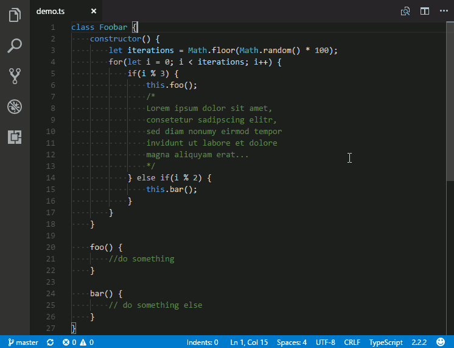

[](https://travis-ci.org/SirTori/indenticator)

# Indenticator

Visually highlights the current indent depth.

This extension can be used by itself, but it's recommended to use it alongside the built-in indent guides (setting **editor.renderIndentGuides**). These show thin grey lines on *every* indent, while this extension highlights the indent on the indent depth the cursor is currently on.

**Changes in Visual Studio Code 1.23.0**:<br/>
With Version 1.23.0 VS Code introduced a new built-in active indent guide. For an explanation of differences and tips regarding the new feature and this extension please see [remarks section](#remarks)

<table>
  <tr>
    <td></td>
  </tr>
  <tr>
    <td>Example using default settings</td>
  </tr>
</table>


## Feature Highlights

- **Peeking around the current indent block**: *Optionally* a hover can be added on the current indent marker to peek before and/or after the current indent block.<br/>
*To activate set **indenticator.showHover** to `true`*

  <table>
    <tr>
      <td></td>
      <td></td>
    </tr>
    <tr>
      <td>Example has <b>indenticator.hover.peekBack</b> & <b>indenticator.hover.peekForward</b> set to <code>1</code> and <b>indenticator.hover.highlight</b> set to <code>true</code></td>
      <td>Example has <b>indenticator.hover.peekBack</b> & <b>indenticator.hover.peekForward</b> set to <code>1</code> and <b>indenticator.hover.highlight</b> set to <code>false</code></td>
    </tr>
  </table>

- **Highlighting the the indent guide for the contained block**: *Optionally* a second indent guide can be configured to show the block *contained* by the current cursor position<br/>
*To activate set **indenticator.inner.showIndentGuide** to `true`*

  <table>
    <tr>
      <td></td>
    </tr>
    <tr>
      <td>Example has <b>indenticator.inner.showIndentGuide</b> set to <code>true</code> and <b>indenticator.inner.color.dark</b> set to <code>#ff000</code></td>
    </tr>
  </table>


- **Language specific settings**: The extension can be configured for each language separately to accommondate the requirements of different coding styles.

  Example:
    ``` JS
    {
      "indenticator.languageSpecific": {
        "[json, jsonc]": {
          //...
        },
        "[xml, html, xhtml]": {
          //...
        }
      }
    }
    ```

- **Highlight Styling**: All indent highlighting can be styled individually by defining color, width and border style.

## Settings and defaults
``` JS
{
    /******************************************************/
    /********** Standard Indent Highlight Config **********/
    /******************************************************/
    /* Whether to highlight the indent of the block enclosing the current line */
    "indenticator.showIndentGuide": true
    /* Color of the indent marker for dark themes */
    "indenticator.color.dark": "#888",
    /* Color of the indent marker for light themes */
    "indenticator.color.light": "#999",
    /* Width of the indent marker in pixels */
    "indenticator.width": 1,
    /* Line style of the indent marker (e.g. "inset", "dashed", "dotted", ...) */
    "indenticator.style": "inset",
    /* Whether to display the hover near the indent line */
    "indenticator.showHover": false,
    /* Wether to highlight the contained code block when hovering the indent line. If activated, the peeked content will be shown at top or bottom of the block, otherwise it will be shown at cursor position.*/
    "indenticator.hover.highlight": true,
    /* Lines before the current indent to be shown on hover */
    "indenticator.hover.peekBack": 1,
    /* Lines after the current indent to be shown on hover */
    "indenticator.hover.peekForward": 0,
    /* Remove lines from the hover at the beginning and end that have less characters than this */
    "indenticator.hover.trimLinesShorterThan": 2,
    /* Block placeholder to be written between peeked lines */
    "indenticator.hover.peekBlockPlaceholder": "...",

    /***************************************************/
    /********** Inner Indent Highlight Config **********/
    /***************************************************/
    /* Whether to highlight the indent of the block enclosed by the current line */
    "indenticator.inner.showHighlight": false
    /* Color of the indent marker for dark themes */
    "indenticator.inner.color.dark": "#888",
    /* Color of the indent marker for light themes */
    "indenticator.inner.color.light": "#999",
    /* Width of the indent marker in pixels */
    "indenticator.inner.width": 1,
    /* Line style of the indent marker (e.g. "inset", "dashed", "dotted", ...) */
    "indenticator.inner.style": "inset",
    /* Whether to display the hover near the inner indent line */
    "indenticator.inner.showHover": false,
    /* Wether to highlight the contained code block when hovering the indent line. If activated, the peeked content will be shown at top or bottom of the block, otherwise it will be shown at cursor position.*/
    "indenticator.inner.hover.highlight": true,
    /* Lines before the current inner indent to be shown on hover */
    "indenticator.inner.hover.peekBack": 1,
    /* Lines after the current inner indent to be shown on hover */
    "indenticator.inner.hover.peekForward": 0,
    /* Remove lines from the inner indent hover at the beginning and end that have less characters than this */
    "indenticator.inner.hover.trimLinesShorterThan": 2,
    /* Block placeholder to be written between peeked lines */
    "indenticator.inner.hover.peekBlockPlaceholder": "...",
    /* Whether to display the current indent depth on the statusbar */

    /********************************************/
    /********** Further Configurations **********/
    /********************************************/
    "indenticator.showCurrentDepthInStatusBar": true,
    /* A construct with language identifiers as properties containing a subset of indenticator options to be applied for that language */
    "indenticator.languageSpecific": {}
}
```
### Remarks
- **New Built-in active indent guide (VS Code 1.23.0)**
  - The built-in active indent guide always highlights the *highest* indent on the currently selected line, while this extensions highlights the indent depth the *cursor is currently at*. The difference can be seen in the following image:

    |  |
    |- |
    | *yellow* is the new built-in active indent guide<br/>*red* is the inner active indent guide of this extension<br/>*grey* is the default active indent guide of this extension |

  - The built-in *active* indent guide can be configured through the setting: **editor.highlightActiveIndentGuide**

- **indenticator.languageSpecific**: The language identifiers can be viewed by using [VS Codes language selection](https://code.visualstudio.com/docs/languages/overview#_language-id) in the statusbar. To be analogous to [language specific editor options](https://code.visualstudio.com/docs/getstarted/settings#_language-specific-editor-settings) of VS Code the key has to be put between square brackets. But to simplify configuration of similar languages multiple keys can be listed within the square brackets as a comma seperated list.

  Any setting for indenticator that can be set normally, can also be set for the language specific configuration. If any setting is not set for the specific language the overall configuration will be used.

  Example:
  ``` JS
  {
    "indenticator.languageSpecific": {
      "[json, jsonc]": {
        "indenticator.showHover": true,
        "indenticator.hover.peekBack": 1
      }
    }
  }
  ```